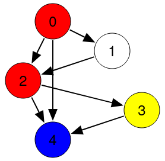

Pfade auflisten
Schreiben Sie eine rekursive Funktion

function listPaths(graph)
welche alle Wege (Pfade) durch einen gerichteten Graphen auflistet. Ein Graph besteht aus Knoten (im Bild unten Kreise) und gerichteten Kanten (im Bild Pfeile). Zudem hat in unserem Fall jeder Knoten einen Index (angefangen bei 0) und eine Farbe.

Ein Graph wird in dieser Aufgabe als Array repräsentiert, wobei jeder Eintrag einen Knoten beschreibt. Jeder Knoten ist ein Objekt vom Typ Node:

```
class Node
{
public:
    constructor(color_, edges_)
    {
        color = color_;
        edges = edges_;
    }
    var color;
    var edges;
}
```

Dabei ist ```edges``` ein Array von Indizes. Jeder Index ist eine Verbindung zu einem Knoten: Der Knoten selbst ist der Ausgangspunkt der Verbindung, und der gelistete Index ist der Zielpunkt der Verbindung. Beispielsweise kann ein Graph wie folgt aussehen:



Dieser Graph wird durch die folgende Datenstruktur beschrieben:
```
var graph = [
    Node("red", [1,2,4]),
    Node("white", [2]),
    Node("red", [3,4]),
    Node("yellow", [4]),
    Node("blue", [])
];
```

Auf diesem Graphen ist es nicht möglich, im Kreis zu laufen. Einen solchen Graphen nennt man "Directed Acyclic Graph" (DAG). Wir arbeiten im Folgenden nur mit DAGs.

Die Aufgabe der Funktion listPaths besteht jetzt darin, alle möglichen Pfade zurückzugeben, die an irgendeinem Knoten starten und an irgendeinem Knoten enden. Im Extremfall kann das derselbe Knoten sein, so dass der Pfad nur einen Knoten enthält. Das Ergebnis soll ein Array von Arrays sein, wobei jedes innere Array die Knoten eines Pfades in ihrer Reihenfolge auflistet. Für den Beispielgraphen besteht die korrekte Rückgabe aus insgesamt 23 möglichen Pfaden:

```
[
    [0],
    [0, 1],
    [0, 1, 2],
    [0, 1, 2, 3],
    [0, 1, 2, 3, 4],
    [0, 1, 2, 4],
    [0, 2],
    [0, 2, 3],
    [0, 2, 3, 4],
    [0, 2, 4],
    [0, 4],
    [1],
    [1, 2],
    [1, 2, 3],
    [1, 2, 3, 4],
    [1, 2, 4],
    [2],
    [2, 3],
    [2, 3, 4],
    [2, 4],
    [3],
    [3, 4],
    [4]
]
```


Die Pfade können in einer beliebigen Reihenfolge gelistet werden. Wichtig ist, dass alle Pfade dabei sind, und dass jeder Pfad nur einmal vorhanden ist.

An dieser Stelle führen wir noch eine weitere Komplikation ein: Unser Pfad-Algorithmus hat eine Aversion gegen eine Farbe. Er soll keine Pfade zurückliefern, die einen Knoten in der Farbe "blue" enthalten. Knoten mit Farbe blue sollen einfach ignoriert werden, als wären sie nicht vorhanden.

Das Problem soll durch eine Rekursion gelöst werden. Dazu können Sie wie folgt vorgehen:

* Wenn der Graph leer ist, also keine Knoten enthält, so ist die Liste der möglichen Pfade ein leeres Array.
* Gibt es n>0n>0 Knoten, so lässt sich das Problem auf ein Problem mit n-1n−1 Knoten zurückführen. Dazu wird die Funktion rekursiv mit den ersten n-1n−1 Knoten aufgerufen. Es gibt jetzt drei Arten von Pfaden:
 
  1) Pfade ohne den letzten Knoten (die direkt vom rekursiven Aufruf zurück kommen),
  2) Pfade mit dem letzten Knoten (Verlängerungen der Pfade zum letzten Knoten, wenn eine Verbindung existiert),
  3) der Pfad, der nur aus dem letzten Knoten besteht.

   Die erste Kategorie von Pfaden gibt es immer. Die zweite und dritte Kategorie gibt es nur dann, wenn der letzte Knoten nicht die Farbe blue hat.

Hinweis: Beachten Sie, dass Arrays veränderliche Werte sind. Das führt hier leicht zu Fehlern. Wenn Sie einen Pfad path kopieren wollen, dann nutzen Sie Array(path). Alternativ können Sie die Funktion deepcopy nutzen. Dieselbe Technik funktioniert, wenn Sie eine Liste von Pfaden kopieren wollen.
